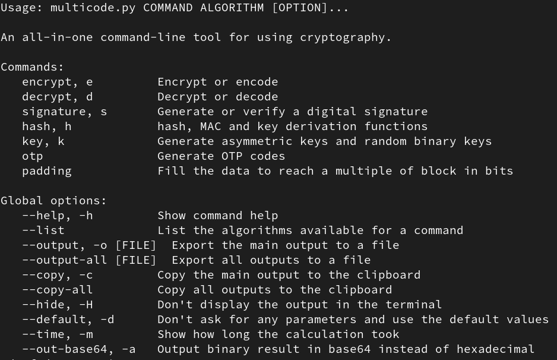
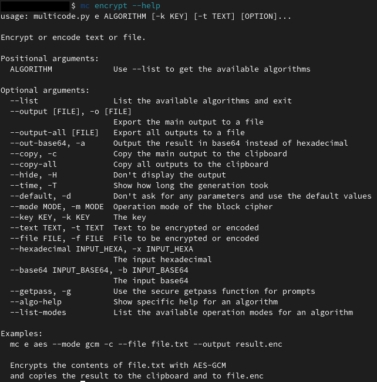
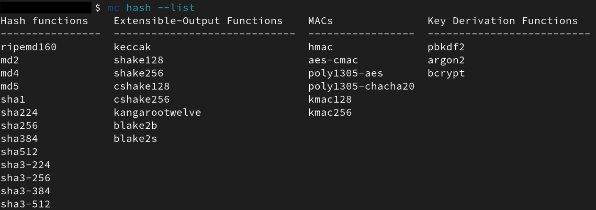
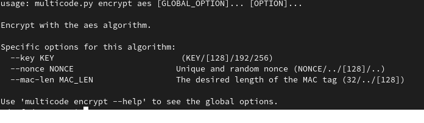
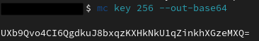
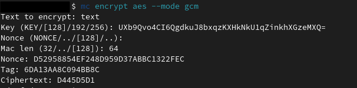
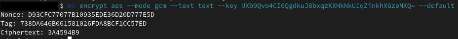

# Multicode

> **An all-in-one command-line tool for using cryptography.**
> **This is an old project I started when I was 15, after I became fascinated with cryptography; the code is poorly optimized in some places.**

## Overview and features

**Multicode is a powerful, comprehensive command-line tool that centralizes a variety of cryptographic algorithms mainly based on PyCryptodome and Cryptography modules. There are plenty of options available to customise each algorithm, offering a variety of possibilities for the practical application of cryptography. The tool is designed to be clear and accessible while retaining its rich functionality.**

- **Encrypt and decrypt data** using symmetric or asymmetric, modern or legacy algorithms (`RSA`, `chacha20`, `AES`, and much more)
- **Encode and decode text** in `base64`, `hexadecimal`, `base32`, and more.
- **Use hash, MAC and key derivation functions** (`md5`, `sha`, `blake`, `HMAC`, `PBKDF2`, `argon2`, `bcrypt`, and more)
- **Generate** `RSA`, `DSA`, `ECC` **key** pairs and random bytes of specified length.
- **Sign and verify messages** with `rsassa`, `pss`, `dss`, `eddsa`.
- Generate and verify TOTP or HOTP double authentication codes.
- Use padding functions to fill data to a multiple of the block in bits.
- Options for copying the result to the clipboard, writing the result to a file,
measure the time taken by a command, hide inputs, hide outputs, and more.
- You can either specify a parameter in the command (example `--key KEY`), or leave it unspecified and **let the program guide you to generate a new value, for example.** Option `--default` to use default parameters.
- The input is either text `--text TEXT`, binary encoded in base32, base64 or hexadecimal `--data BINARY_ENCODED`, or the contents of a file.

## Installation

Python 3.7 minimum is required.

Install dependencies:

    py -m pip install -r requirements.txt

If you encounter problems installing the pycryptodome module,
please refer to [its documentation](https://pycryptodome.readthedocs.io/en/latest/src/installation.html#): [here](https://pycryptodome.readthedocs.io/en/latest/src/installation.html#windows-from-sources-python-3-5-and-newer) for Windows and [here](https://pycryptodome.readthedocs.io/en/latest/src/installation.html#compiling-in-linux-ubuntu) for Linux.

## Usage and examples

__Usage: multicode.py COMMAND ALGORITHM [OPTION]...__

Use the `python3 multicode.py` command to launch the utility.
This command displays available commands and global options.

Add `--help` with any command to see the specific options for a command.

To see the algorithms available for a command, use the `--list` option.

To view algorithm-specific options for adjusting its parameters,
use the `--algo-help` command. For example `multicode encrypt aes --mode gcm --algo-help`.

*Generate a 256-bit random binary string:*

Non-optional algorithm parameters, that are not specified in the command option are requested.
Leave empty to generate a default value, the other possible values are specified.
Example: `Key (KEY/[128]/192/256):`
- Leave blank to generate a key of the recommended length in square brackets.
- Enter `256` to generate a 256-bit key.
- Enter a hexadecimal, base64 or base32 key to use your own key.

*Encrypt “text” with the previously generated key and use the other default parameters:*

## Notes:

If you receive the error “QSocketNotifier: Can only be used with threads started with QThread”
when copying the result to Linux, install the xclip package.
